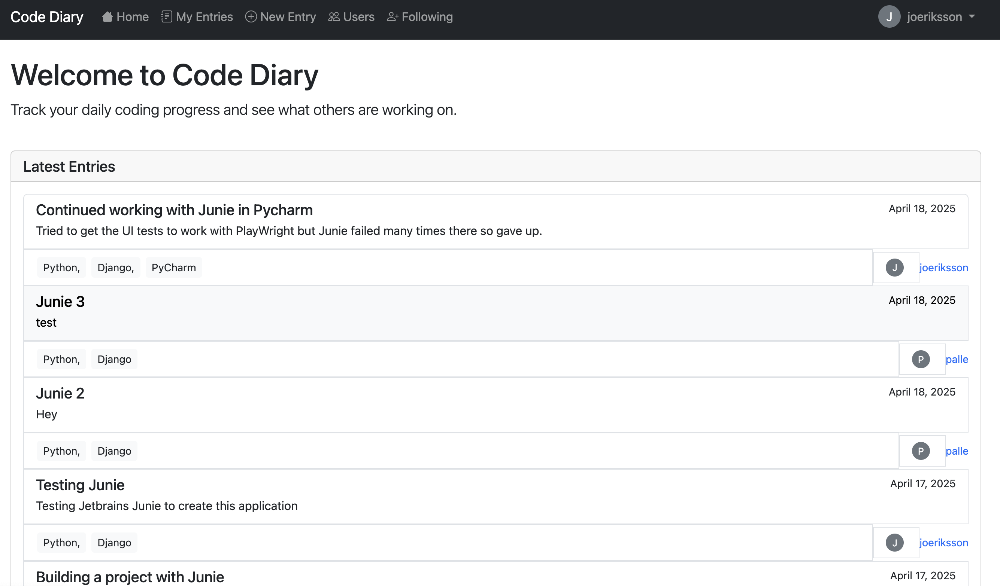

# Code Diary

A web-based diary application to track your daily coding activities and progress.



## Description

Code Diary is a Django application that allows you to keep a diary of what you code each day. You can create, view, edit, and delete diary entries, including information about the technologies you used.

## Prerequisites

- Python 3.12 or higher
- [uv](https://github.com/astral-sh/uv) - Python package manager and installer

## Installation

### Clone the repository

```bash
git clone https://github.com/yourusername/code-diary.git
cd code-diary
```

### Set up a virtual environment with uv

```bash
uv venv
```

### Activate the virtual environment

On macOS/Linux:
```bash
source .venv/bin/activate
```

On Windows:
```bash
.venv\Scripts\activate
```

### Install dependencies with uv

```bash
uv install  # Install regular dependencies
```

### Install development dependencies (for testing)

```bash
uv install ".[dev]"  # Install development dependencies
```

## Running the Application

### Apply migrations

```bash
python manage.py migrate
```

### Create a superuser (optional)

```bash
python manage.py createsuperuser
```

### Start the development server

```bash
python manage.py runserver
```

The application will be available at http://127.0.0.1:8000/

## Running Tests

The project uses pytest for testing. Make sure you have installed the development dependencies first (see "Install development dependencies" section above).

### Running Unit and Integration Tests

To run the tests:

```bash
pytest
```

Or you can use:

```bash
python -m pytest
```

The tests will run in parallel automatically, using all available CPU cores. This is configured in the pytest.ini file with the `-n auto` option.

### Running UI Tests

The project includes UI tests using Playwright. Before running the UI tests, you need to install the Playwright browsers:

```bash
playwright install
```

The UI tests require a running server. Make sure to start the development server in a separate terminal before running the UI tests:

```bash
python manage.py runserver
```

Then, in another terminal, run the UI tests:

```bash
pytest ui_tests/
```

Note: The UI tests use the `DJANGO_ALLOW_ASYNC_UNSAFE` environment variable to allow database operations in an async context. This is set automatically in the test code and is only used for testing purposes.

The UI tests create a test user and test entries, which are automatically cleaned up after all tests are done. This ensures that the database is not polluted with test data after running the tests.

## Project Structure

- `code_diary/` - The main Django app containing models, views, and templates for the code diary functionality
- `core/` - The Django project folder containing settings and URL configurations
- `templates/` - Global templates directory
- `ui_tests/` - UI tests using Playwright
- `manage.py` - Django's command-line utility for administrative tasks
- `pyproject.toml` - Project configuration and dependencies
- `pytest.ini` - Configuration for pytest

## Features

- View diary entries without logging in
- Create, edit, and delete diary entries (requires login)
- Track the date, title, content, and technologies used for each entry
- Responsive design using Bootstrap
- Admin interface for managing entries
- Authentication system to protect diary entries
- User profiles with following/follower functionality
- View other users' diary entries
- Follow/unfollow other users
- Notifications for new entries from users you follow
- Automatic tracking of read entries (notifications disappear after reading)
- List of all users with follow/unfollow buttons
- Lists of users you follow and users following you
